## SILVIATIERRA

- Esta ayudando a mejorar el manejo forestal en los Estados Unidos.
- Aumentando el retorno de la inversión.
- Equipo de emprendedores de la Universidad de Yale, USA.

## "Better data, better decisions"

---

## CruiseBoost -> parcelas + imágenes =

- 25% de ahorro para rodal
- 60% de ahorro para estrato
- alta calidad y resolución
- manten el protocolo normal de muestreo 
  - usa el grillado estandar
- bajo riesgo 

    

--- &twocol1

## CruiseBoost para rodal

### _Menor costo_ y _mayor precisión_ vs muestreo no asistido

*** {name: left}

--Muestreo no asistido--

- 22 parcelas:
  - Costo = 440$USD
  - Precisión = 65%

    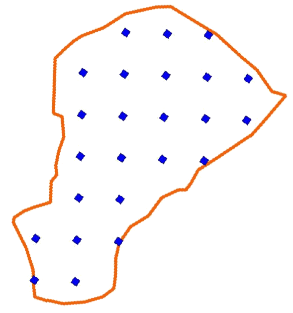

    

*** {name: right}

--CruiseBoost--

- 14 parcelas + asistencia por imágenes:
  - Costo = 335$USD
  - Precisión = 90%

    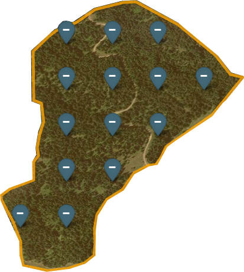

    

--- &slide1

## CruiseBoost para rodal

    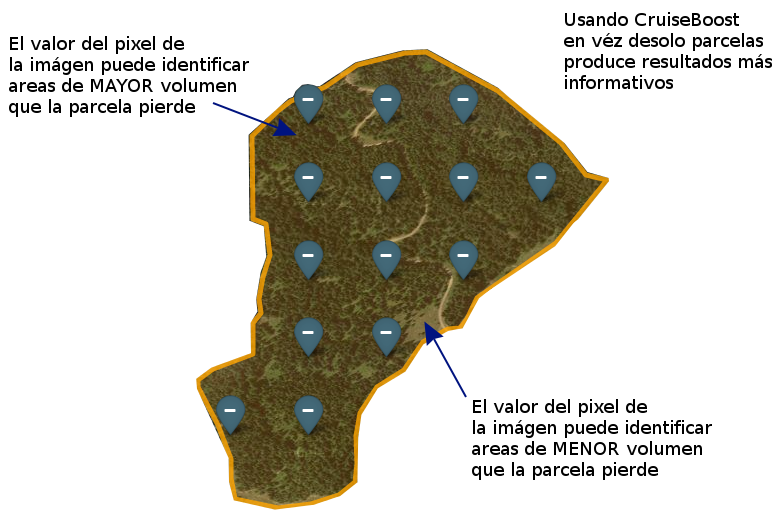

    

--- &slide1

## CruiseBoost para rodal

La relación entre las mediciones realizadas en las parcelas y los valores del pixel
de la imágen permiten la estimación de APH, AB, especies y distribución de los diámetros, 
y por lo tanto listas jerarquicas de todas las areas cubiertas.

    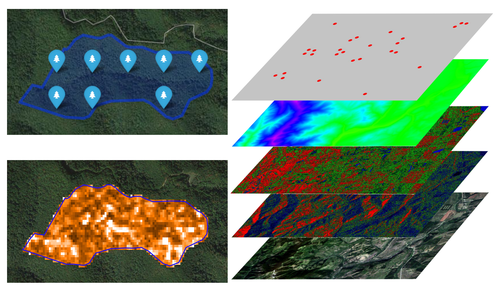

    

--- &slide1

## CruiseBoost para rodal

    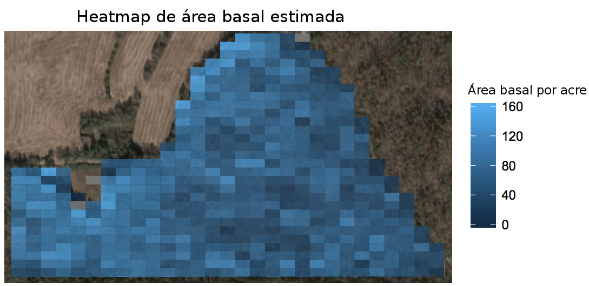

    

    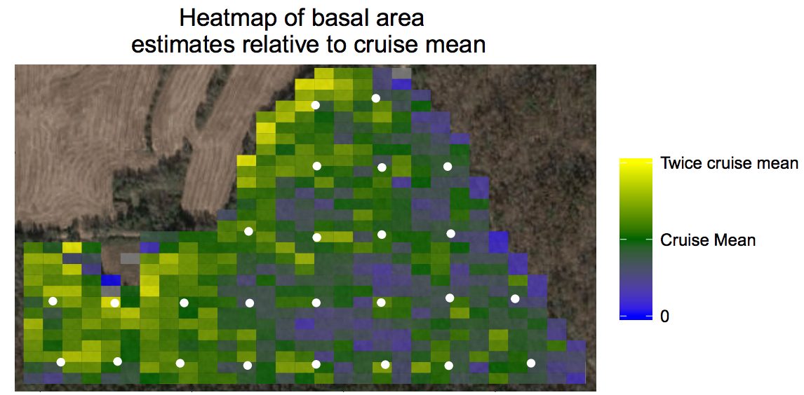

    

--- &slide1

## CruiseBoost para rodal

### Usando parcelas + imágenes:

- Permite ahorrar ~25% en el inventario mientras mantiene o mejora la precisión.
- Resulta en un inventario con un completo treelist, con detalle de _especies_ y _DAP_, y tabla de reporte por rodal que pueden ser resumidos y hacerlos crecer.
- Produce útiles heatmaps que entregan mas información para el personal en terreno.

---&slide2

## CruiseBoost para estrato

### Obtenga eficiencia a escala

- Paga por un muestreo a nivel de *estrato*, y obten información a nivel de rodal.

    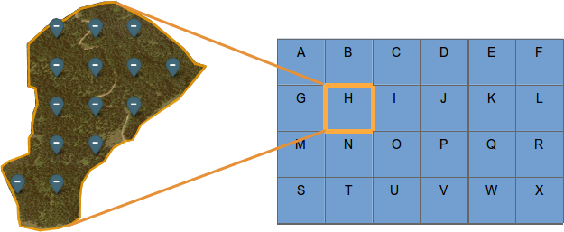

   

## Ahorro de ~60%+

---&slide2

## CruiseBoost para estrato

### Ejemplo de diseño de muestreo CruiseBoost

Las grillas de abajo representan rodaels en un diseño "estrato" de ejemplo con 24 rodales de A hasta la X.

    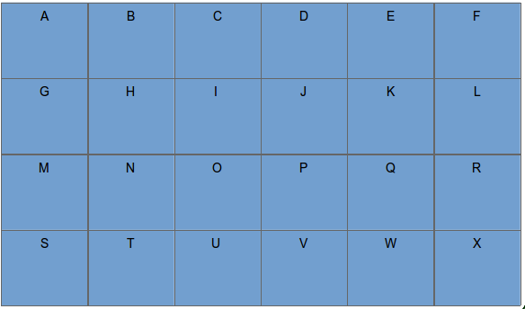

   

Nota para biometricians: CruiseBoost es un muestreo imagen-asistido de dos etapas.

---&slide2

## CruiseBoost para estrato

### Etapa 1: Selección aleatoria de rodales

Se seleccionaron 8 rodales de forma aleatoria de un total de 24.

    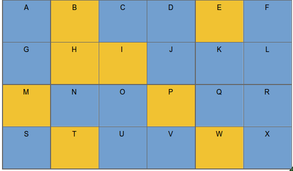

   

---&slide2

## CruiseBoost para estrato

### Etapa 2: Grillas de parcelas en los rodales seleccionados

## Rodal B

    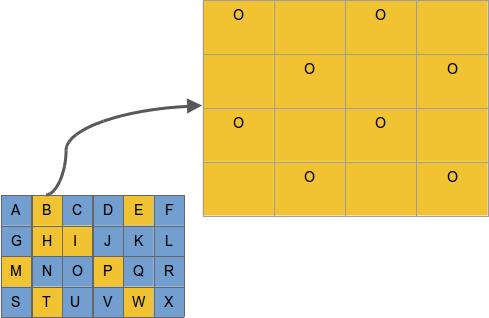

   

--- &twocol2

## CruiseBoost para estrato

### Nivel de análisis de estrato

*** {name: left}

Estrato = $\sum{[A-X]}$  
(suma de todos los rodales)

- *Solo parcelas*: estimación no sesgada de la poblacion 
  - +/- 6% error de muestreo
- *Parcelas + imagenes*:estimación no sesgada de la poblacion 
  - +/- 3% error de muestreo

*** {name: right}

    

   

--- &twocol2

## CruiseBoost para estrato

### Nivel de análisis de rodales (rodales muestreados)

*** {name: left}

Muestreados = [B,E,H,I,M,P,T,W]

Para cada uno de los rodales:

- Solo parcelas: 
  - Pecisión = 70%
- Parcelas + imagenes
  - Pecisión = 90%

Heatmap de sub-rodal para especie, volumen

*** {name: right}

    
    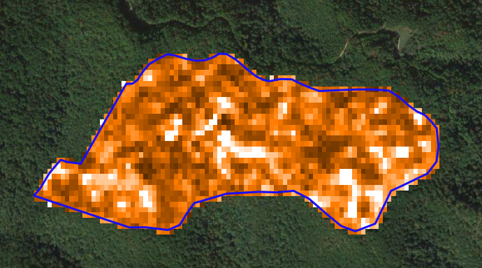

   

--- &twocol2

## CruiseBoost para estrato

### Nivel de análisis de rodales (rodales no muestreados)

No muestreados = [A,C,D,F,G,J,K,L,N,O,Q,R,S,U,V,X]

*** {name: left}

Para cada uno de esos rodales:

- Treelist y tabla-rodal.
- Precisión = 90%
- Sub-rodal heatmap para especie, volumen, etc.

*** {name: right}

    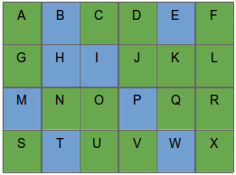

   

--- &twocol2

## CruiseBoost para estrato

### Economía

24 rodales | 389 há | Información nivel de rodal | 90% precision

*** {name: left}

*Solo parcelas*

Inputs:    

- 24 rodales muestreados con parcelas
- 20 parcelas por rodal
- $20 por parcela

Total:

= $ 9.600  

$24.7 / há

*** {name: right}

*Parcelas + imágenes*

Inputs:

- 8 rodales muestreados con parcelas
- 10 parcelas por rodal
- $20 por parcela

- $6.2/há por imagenes y análisis
Total:

= $ 4.012  

$10.3 / há

~60% reducción de costo

---

## CruiseBoost es:

- Mas barato que muestreo solo con parcelas a nivel de rodal
- Mas informativo que los diseño a nivel de estrato 
- Rapido, ideal para adquisiciones
- Preciso, estimaciones no sesgadas
- Alta resolución para operacion y planeamiento
- Sin riesgo

---

## CruiseBoost es ideal para:

- Adquisiciones / ventas
- Cierre de corona
  - Obten el nivel de detalle de rodal que necesita para decidir en la fecha de raleo
- Despues del raleo
  - Proporciona el precisio detalle a nivel de arbol que necesita para projectar futuras condiciones.
- Rodales naturales y mezclados
  - Información específica de especies.
  - Mejoras significativas para rodales con gran variación

---

## Ejemplo (Here we can show results)

<iframe src="./assets/widgets/chilean_forest.html" width=100% height=100% allowtransparency="true"> </iframe>

--- &vcenter

## ¿Preguntas?

    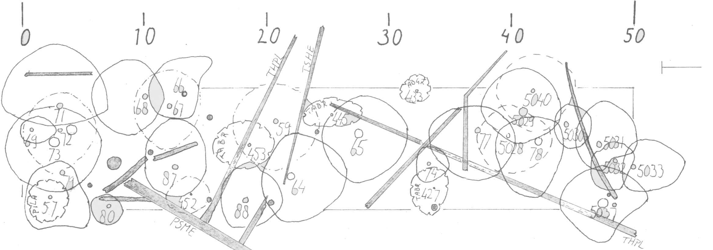

   

Si piensas en alguna luego, escribeme

